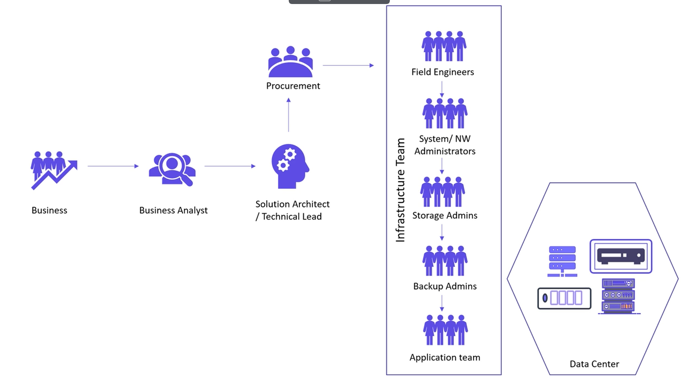

# KodeKloud Terraform Basics

## Introduction to IaC

### Challenges with traditional IT Infra

Traditionally followed a similar flow of:

- Business defines requirements for application
- Business analyst takes these requirements and turns them into a set of high-level technical requirements that are actionable
- Solution architect designs architecture that application will deployed with
- Would be deployed in on-prem environment (if new hardware needed, goes via procurement team)

 Entire flow might look something like:

 

 By following this flow, the overall process is time consuming before the infrastructure is ready to be handed back to the application team. There are also some other downsides to the approach:

 - To stand up infra is quite expensive - especially if more has to be procured
 - There are limited opportunities for automation resulting in a greater chance of human error at stages in the process
 - The end result is environments that have inconsistencies 

With cloud resources and infrastructure, many of these things are mitigated (especially time taken to spin up the application itself), but there are still many different teams invovled and a high chance of error - hence shell scripts and in house programs aimed at solving this issue.

### IaC Tools

Types of IaC tools aimed at achieving slightly different things can be divided into 3 broad categories:

**Configuration Management**
- Ansible
Puppet
Saltstack

Used to intstall and manage resources that already exist on infrastructure. Has version control, and is idempotent

**Server Templating**
- Docker
- Packer
- Vagrant

Good for creating a custom image of a virtual machine or container. Images contain all software and dependencies needed already.

**Provisioning Tools**
- Terraform
- CloudFormation

Used to provision infrastructure using code that is easily readable.

### Why Terraform?

- Helps us to go from nothing (or something) to the desired state

Three phases:

**Init**
The project is initialised and figures out the needed providers in order to achieve the desired state.

**Plan**
A plan is drafted on how to get to the desired state (defining resources wanted as part of end result).

**Apply**
The necessary changes are made in order to deploy the resournces that are outlined from the plan phase.

## Getting Started With Terraform

### Installing Terraform

1. Download binary from [Terraform IO](https://terraform.io)
2. Unzip the binary and move it to the system path
3. To check it is installed we can run `terraform version`

Terraform uses configuration files written in HCL - ending in `.tf` which can be created using any text editor.

**Resources**

An object that we want to manage - could be anything from a load balancer, virtual machine, groups, rules, policies, users, or s3 bucket/storage blob.
### HashiCorp Configuration Language (HCL)

HCL comprises of blocks and arguments. A block is defined within curly brackets containing a set of key value pair arguments that represents the configuration data.

```terraform
resource "local_file" "pet" {
    filename = "/root/pets.txt"
    content = "Pets are great"
}
```

- Resource is the block name
- local = provider, file = resource type
- pet = resource name
- filename and content = arguments

The Terraform workflow consists of 4 steps:

1. Write configuration file
2. Run Terraform Init command
3. Review execution plan using Terraform plan command
4. Apply changes using Terraform Apply command

Different providers have different arguments that can be used. Referring to the documentation will tell us which arguments can be used and which are supported.

### Updating and Destroying Infra

